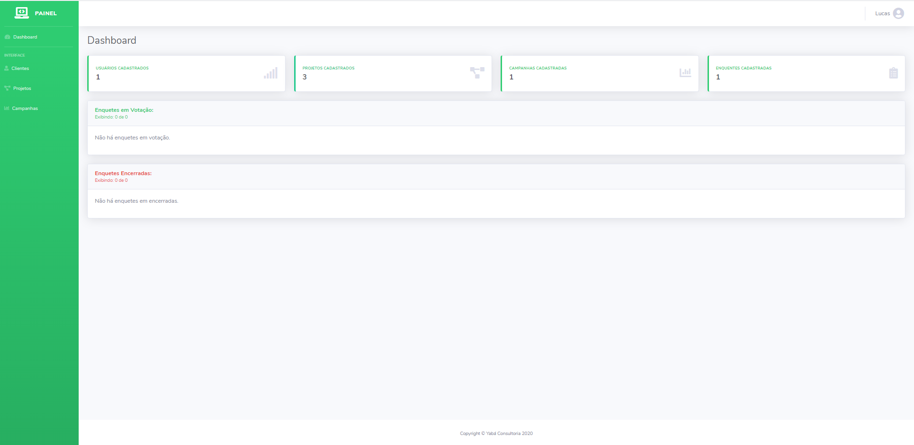
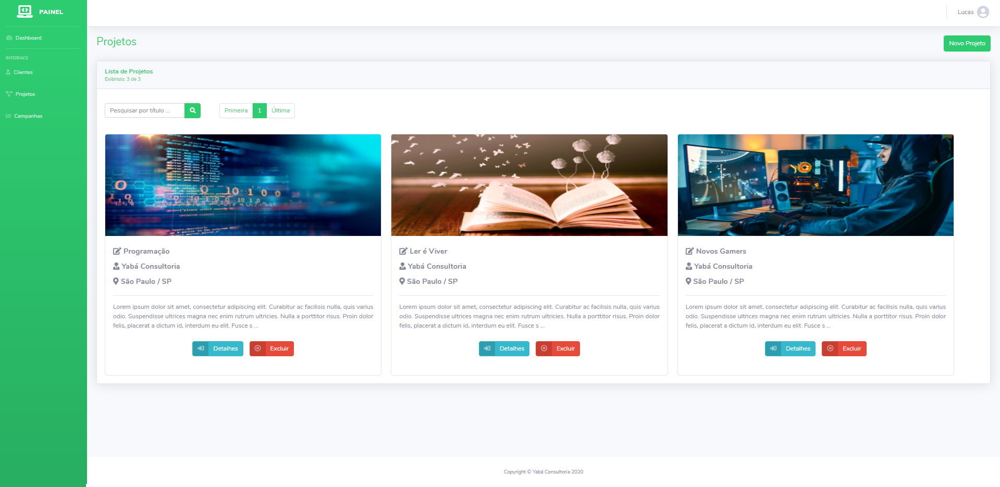
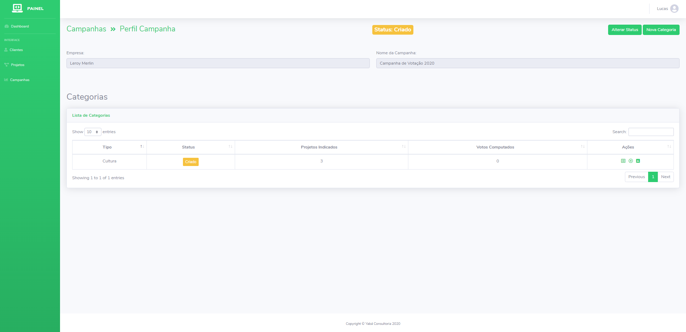
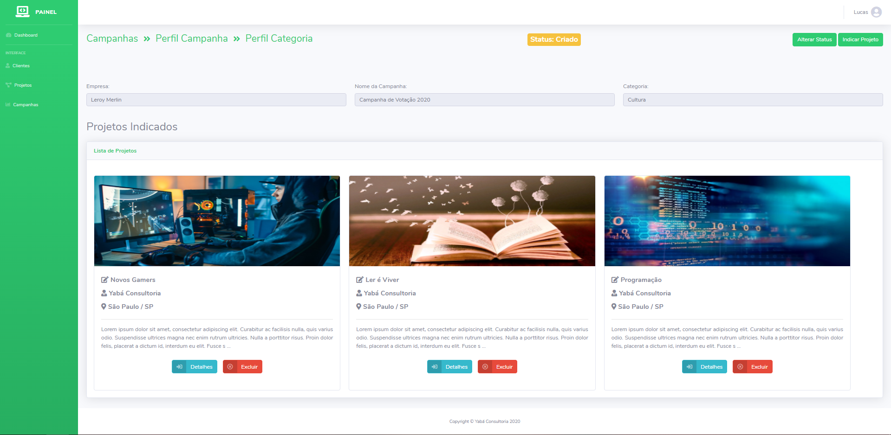
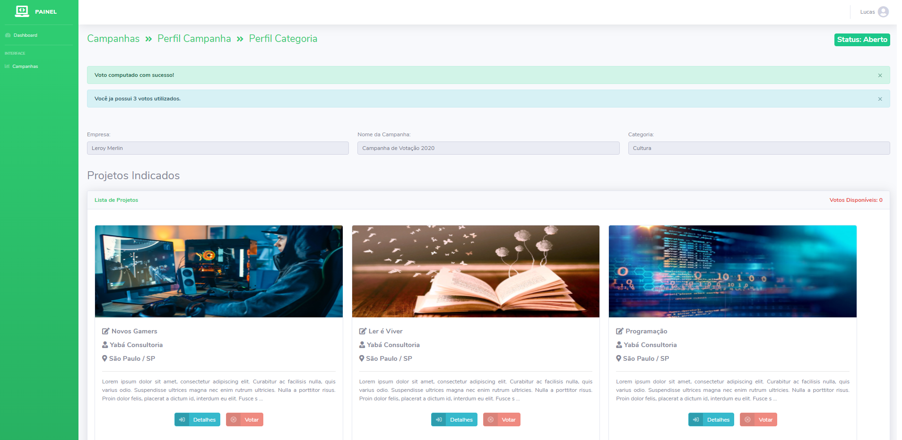
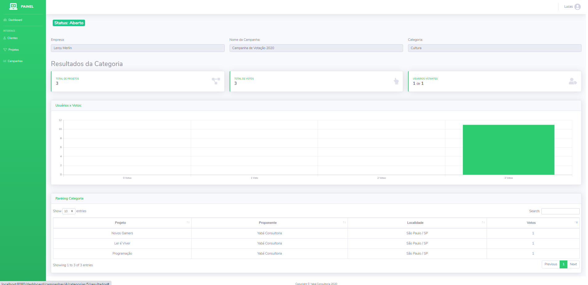

# Curadoria - Yabá Consultoria

## Sobre:
O projeto foi desenvolvido com intuito de automatizar a agilizar os processo de seleção de projetos apoiados via Lei de Incentivo Fiscal.

## Arquitetura:
O projeto foi estruturado em uma arquitetura server-side com base nos design patters do Spring MVC e template engine JSP.

## Tecnologias & Frameworks:
Back-end desenvolvido em Java com Spring Boot frameworks.
- Apache Tomcat Server 9.0;
- Spring Boot Starter;
- Persistência de Dados: Spring Boot JPA / Hibernate;
- Banco de Dados: MySQL;
- Lombok.

Front-end desenvolvido template engine JSP.
- *Custom* -Starter Bootstrap Modern Business Template;
- *Custom* Starter Bootstrap Dashboard Admin Template;
- Bootstrap 4.0;
- DataTables Bootstrap;
- Jquery, Jquery Mask Input, Jquery Mask Money;
- Charts JS;
- Font Awesome.

## Imagens
- Dashboard

-Lista de Projetos

- Campanha

- Categoria

- Votação

- Resultados
